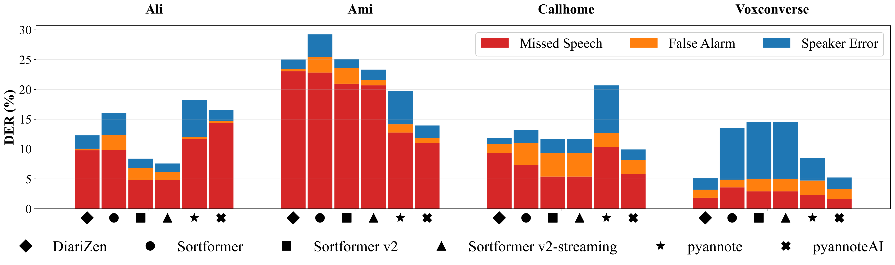

# Benchmarking Diarization Models

An open-source evaluation platform for comparing speaker diarization systems out-of-the-box, across multiple datasets, languages, and acoustic conditions.

This repository accompanies the bachelor's thesis *"Benchmarking Diarization Models"* (ETH Zürich, Distributed Computing Group, 2025) and provides a unified pipeline to **generate predictions** and **evaluate performance** for any speaker diarization model — without parameter tuning or domain-specific modifications.

## Why This Project?

Speaker diarization — answering *"who spoke when"* — is a critical preprocessing step for meeting transcription, call analytics, and speech recognition. While many diarization models exist, comparing them fairly is difficult: different papers use different datasets, metrics, evaluation collars, and post-processing steps.

This platform solves that by providing:

- **Standardized evaluation** across four datasets and five languages
- **Out-of-the-box testing** — models are evaluated as a practitioner would deploy them
- **Modular architecture** — add new models or datasets with minimal code changes
- **Reproducible results** — all predictions saved as JSON for inspection and re-evaluation

## Results

We evaluated five diarization systems across 196.6 hours of multilingual audio. PyannoteAI (commercial) achieved the best overall DER of 11.2%, while DiariZen provided the strongest open-source performance at 13.3% DER.

### DER Performance Overview

<!-- Replace with your actual figure path -->

*Diarization error rate across models showing missed speech (red), false alarm (orange), and speaker confusion (blue) components. Lower is better.*

### Per-Language DER (%)

| Model            | Zho   | Eng   | Deu   | Jpn   | Spa   |
|------------------|-------|-------|-------|-------|-------|
| DiariZen         | 10.1  | 7.0   | 11.6  | 15.6  | 19.1  |
| Sortformer       | 13.1  | 15.5  | 11.1  | 16.5  | 21.9  |
| Sortformer v2    | **9.2** | 15.3 | 9.6  | **12.7** | 21.1 |
| SF v2-streaming  | 9.4   | 14.1  | 9.6   | **12.7** | 21.1 |
| pyannote         | 19.8  | 11.5  | 19.0  | 28.8  | 27.3  |
| PyannoteAI       | 10.0  | **6.6** | **8.3** | 13.8 | **14.3** |

### Per-Speaker Count DER (%)

| Model            | 1 spk | 2 spk | 3 spk | 4 spk | 5+ spk |
|------------------|-------|-------|-------|-------|---------|
| DiariZen         | 2.3   | 11.4  | 10.3  | 12.7  | **7.1** |
| Sortformer       | **1.5** | 11.5 | 14.7 | 21.3  | 23.9    |
| Sortformer v2    | 4.7   | 10.1  | 14.3  | 16.7  | 22.7    |
| SF v2-streaming  | 4.7   | 10.4  | 14.1  | 13.2  | 22.7    |
| pyannote         | 3.2   | 19.9  | 19.8  | 17.1  | 10.6    |
| PyannoteAI       | 2.7   | **9.9** | **9.1** | **10.1** | 6.6 |

**Key findings:**
- Missed speech is the dominant error mode across all specialized models
- No single model wins across all languages — model choice depends on deployment scenario
- Sortformer v2 achieves exceptional computational efficiency (214.3x real-time) while maintaining competitive accuracy

For full analysis, see the [thesis](https://arxiv.org/abs/2509.26177.pdf).


### Architecture Overview

The pipeline is designed around **dependency isolation**: each diarization model requires its own conda environment with potentially conflicting packages. The architecture handles this through lazy imports and shell-based orchestration.

```
┌─────────────┐     ┌──────────────┐     ┌───────────┐
│ run_pipeline│────▶│   gen.py      │────▶│  eval.py  │
│    .sh      │     │ (per conda   │     │ (single   │
│ (activates  │     │  environment)│     │  env w/   │
│  conda env) │     └──────┬───────┘     │ pyannote. │
└─────────────┘            │             │  metrics) │
                    ┌──────┴───────┐     └───────────┘
                    │              │
              ┌─────┴─────┐ ┌─────┴──────┐
              │DataLoader  │ │ModelLoader  │
              │(std lib    │ │(lazy import │
              │ only)      │ │ per model)  │
              └────────────┘ └────────────┘
```

- **`data_structures.py`** — All shared types. Every component converts to/from these formats.
- **`data_loader.py`** — Discovers audio files and loads ground truth. Uses only standard library + `librosa`. No model-specific imports.
- **`model_loader.py`** — Each model's imports happen inside its method, so `gen.py` runs in any conda environment without import errors.
- **`gen.py`** — Loads audio via `DataLoader`, loads a model via `ModelLoader`, runs inference, saves predictions as JSON.
- **`eval.py`** — Loads saved predictions + ground truth, computes DER/JER via `pyannote.metrics`, generates reports.

## How to Use

### 1. Set Up Environments

Each model requires its own conda environment. Create them from the provided environment files and install the corresponding requirements:

```bash
# pyannote
conda env create -f environments/environment_pyannote.yml
conda activate pyannote
pip install -r requirements/requirements_pyannote.txt

# NeMo (Sortformer)
conda env create -f environments/environment_nemo.yml
conda activate nemo
pip install -r requirements/requirements_nemo.txt

# DiariZen
conda env create -f environments/environment_diarizen.yml
conda activate diarizen
pip install -r requirements/requirements_diarizen.txt

# PyannoteAI (API-based, lightweight)
conda env create -f environments/environment_pyannoteai.yml
conda activate pyannoteai
pip install -r requirements/requirements_pyannoteai.txt
```

For model-specific setup details, refer to the official documentation:
- [pyannote.audio](https://github.com/pyannote/pyannote-audio) — requires a [HuggingFace token](https://huggingface.co/settings/tokens) with access to [pyannote/speaker-diarization-3.1](https://huggingface.co/pyannote/speaker-diarization-3.1)
- [NeMo Sortformer](https://huggingface.co/nvidia/diar_streaming_sortformer_4spk-v2) — available via the [NVIDIA NeMo toolkit](https://github.com/NVIDIA/NeMo)
- [DiariZen](https://huggingface.co/BUT-FIT/diarizen-wavlm-large-s80-md) — from [BUTSpeechFIT/DiariZen](https://github.com/BUTSpeechFIT/DiariZen)
- [PyannoteAI](https://www.pyannote.ai) — commercial API, requires an API key

### 2. Configure `config.yaml`

Create a `config.yaml` with your dataset paths and model settings:

```yaml
datasets:
  paths:
    callhome: "/path/to/dataset/callhome"
    voxconverse: "/path/to/dataset/voxconverse"
    ami: "/path/to/dataset/ami"
    ali: "/path/to/dataset/ali"

models:
  pyannote:
    model_path: "pyannote/speaker-diarization-3.1"
    device: "cuda"
  nemo:
    model_path: "nvidia/diar_streaming_sortformer_4spk-v2"
    device: "cuda"
  diarizen:
    model_path: "BUT-FIT/diarizen-wavlm-large-s80-md"
    device: "cuda"
  pyannoteai:
    api_endpoint: "https://api.pyannote.ai"

paths:
  results_base: "predictions"
  evaluation_results: "evaluation_results"

evaluation:
  collar_seconds: 0.25

processing:
  override_predictions: false
  batch_size: 1
```

API keys are read from environment variables — never stored in config:

```bash
export HF_TOKEN="your_huggingface_token"
export PYANNOTEAI_API_KEY="your_pyannoteai_key"
```

### 3. Run the Pipeline

**Generate predictions** for a model/dataset combination (activate the correct conda environment first):

```bash
conda activate pyannote
python -m src.gen --model pyannote --dataset callhome
```

```bash
conda activate nemo
python -m src.gen --model nemo --dataset ami
```

```bash
conda activate diarizen
python -m src.gen --model diarizen --dataset voxconverse
```

**Evaluate predictions** (requires only `pyannote.metrics`):

```bash
python -m src.eval --model pyannote --dataset callhome
python -m src.eval --model nemo --dataset ami
```

**Automate with `run_pipeline.sh`:** Update the script with your conda paths and dataset/model combinations, then run:

```bash
bash run_pipeline.sh
```

The shell script handles activating the correct conda environment for each model before calling `gen.py`, then runs `eval.py` for all models in a single environment.

### 4. Prediction Output Format

All predictions are saved as JSON in `{results_base}/{model}/{dataset}/{split}/{audio_id}_prediction.json`:

```json
{
  "audio_id": "eng_0001",
  "dataset": "callhome",
  "split": "eng",
  "language": "eng",
  "model_used": "pyannote/speaker-diarization-3.1",
  "segments": [
    {"start": 0.0, "end": 3.456, "speaker_id": "SPEAKER_00"},
    {"start": 3.789, "end": 7.123, "speaker_id": "SPEAKER_01"}
  ],
  "timestamp": "2025-09-15T14:30:00"
}
```

Evaluation reports (per-file JSON metrics and text summaries) are saved to `{evaluation_results}/{model}/{dataset}/{timestamp}/`.

## Extending the Platform

### Adding a New Model

**1. Add the model to `model_loader.py`** — create a new lazy-import method:

```python
# In model_loader.py

SUPPORTED_MODELS = ["pyannote", "nemo", "diarizen", "pyannoteai", "your_model"]

def _load_your_model(self) -> Any:
    """Load YourModel. All imports inside this method."""
    try:
        from your_model_package import YourPipeline
        import torch

        model_cfg = self.config.get("models", {}).get("your_model", {})
        model_path = model_cfg.get("model_path", "default/model-path")

        pipeline = YourPipeline.from_pretrained(model_path)
        if torch.cuda.is_available():
            pipeline = pipeline.to(torch.device("cuda"))

        return pipeline
    except ImportError as e:
        raise ImportError(f"your_model not available. Error: {e}")
```

**2. Add a processing function in `gen.py`** — convert the model's output to `DiarizationResponse`:

```python
# In gen.py

def your_model_output_to_response(
    raw_output, item: AudioDataItem, model_path: str
) -> DiarizationResponse:
    """Convert YourModel output to the standardized format."""
    segments = []
    for seg in raw_output:
        segments.append(DiarizationSegment(
            start=round(seg.start, 3),
            end=round(seg.end, 3),
            speaker_id=str(seg.speaker),
        ))
    segments.sort(key=lambda x: x.start)

    return DiarizationResponse(
        audio_id=item.audio_id,
        dataset=item.dataset,
        split=item.split,
        language=item.language,
        model_used=model_path,
        segments=segments,
        timestamp=datetime.now().isoformat(),
    )

def process_your_model(model, audio_batch, config) -> ProcessingStats:
    """Process audio with YourModel."""
    # ... iterate over audio_batch.items, call model, convert output, save
```

**3. Register in the dispatch maps** in `gen.py` and `eval.py`:

```python
# gen.py main()
processors = {
    "pyannote": process_pyannote,
    "nemo": process_nemo,
    "diarizen": process_diarizen,
    "your_model": process_your_model,  # Add here
}

# Also add to argparse choices
parser.add_argument("--model", choices=[..., "your_model"])
```

**4. Add config and environment:**

```yaml
# config.yaml
models:
  your_model:
    model_path: "org/your-model-name"
    device: "cuda"
```

No changes to `eval.py` are needed — evaluation works on prediction JSON files regardless of the model that produced them.

### Adding a New Dataset

**1. Add dataset loading to `data_loader.py`:**

```python
# In data_loader.py

DATASET_SPLITS = {
    # ...existing...
    "your_dataset": ["train", "dev", "test"],
}

DATASET_LANGUAGES = {
    # ...existing...
    "your_dataset": "eng",  # or None if language varies by split
}

def _load_your_dataset_audio(self, model_dir=None, override=False) -> AudioDataBatch:
    """
    Load YourDataset.

    Structure: dataset/your_dataset/{split}/audio/*.wav
    """
    base_dir = Path(self.dataset_paths["your_dataset"])
    items_by_split = {}

    for split in self.DATASET_SPLITS["your_dataset"]:
        audio_dir = base_dir / split / "audio"
        split_items = []

        for wav_file in sorted(audio_dir.glob("*.wav")):
            audio_id = wav_file.stem

            if self._should_skip(audio_id, "your_dataset", split, model_dir, override):
                continue
            if not self._validate_audio(str(wav_file)):
                continue

            duration = self._get_duration(str(wav_file))
            if duration is None:
                continue

            split_items.append(AudioDataItem(
                audio_id=audio_id,
                audio_path=str(wav_file),
                split=split,
                language="eng",
                duration=duration,
                dataset="your_dataset",
            ))

        if split_items:
            items_by_split[split] = split_items

    return AudioDataBatch(dataset="your_dataset", items_by_split=items_by_split)
```

**2. Add ground truth loading:**

```python
def _load_your_dataset_gt(self, audio_id: str, split: str) -> GroundTruthAnnotation:
    """Load ground truth — adapt to your GT format (RTTM, JSON, TextGrid, etc.)."""
    gt_path = Path(self.dataset_paths["your_dataset"]) / split / "gt" / f"{audio_id}.rttm"

    segments = []
    # ... parse your GT format into GroundTruthSegment objects ...

    return GroundTruthAnnotation(
        audio_id=audio_id,
        dataset="your_dataset",
        split=split,
        language="eng",
        segments=segments,
    )
```

**3. Register in the loader dispatch dicts** (both `load_audio` and `load_groundtruth` in `data_loader.py`) and add `"your_dataset"` to the argparse `choices` in both `gen.py` and `eval.py`.

**4. Add the dataset path to `config.yaml`:**

```yaml
datasets:
  paths:
    your_dataset: "/path/to/your_dataset"
```

### Expected Dataset Layouts

| Dataset      | Audio files                                          | Ground truth                                  |
|-------------|------------------------------------------------------|-----------------------------------------------|
| CallHome    | `callhome/{lang}/{lang}_DDDD.wav`                    | `callhome/{lang}/{lang}_metadata.json`        |
| VoxConverse | `voxconverse/{split}/eng/*.wav`                      | `voxconverse/{split}/gt/{audio_id}.rttm`      |
| AMI         | `ami/{split}/audio/*.Mix-Headset.wav`                | `ami/{split}/gt/{meeting_id}.json`            |
| ALI         | `ali/{split}/audio/*.wav`                            | `ali/{split}/gt/{gt_id}.json`                 |

## Evaluation Details

Evaluation is performed with [pyannote.metrics](https://github.com/pyannote/pyannote-metrics) using the following settings:

- **DER** (Diarization Error Rate) with 0.25s collar, `skip_overlap=False`
- **JER** (Jaccard Error Rate) with 0.25s collar
- DER components reported individually: missed speech, false alarm, speaker confusion

All metrics are computed as **rates** (not absolute durations) per file, then aggregated. This ensures files of different lengths contribute proportionally.

## Citation

If you use this platform in your research, please cite:

```bibtex
@thesis{blaser2025benchmarking,
  title     = {Benchmarking Diarization Models},
  author    = {Blaser, Cesare},
  school    = {ETH Zürich},
  year      = {2025},
  type      = {Bachelor's Thesis},
  note      = {Distributed Computing Group, supervised by
               Luca A. Lanzendörfer, Florian Grötschla,
               and Prof. Dr. Roger Wattenhofer}
}
```

## Contact

- **Cesare Blaser** — [ceblaser@student.ethz.ch](mailto:cesablaser@gmail.com)
- Distributed Computing Group, ETH Zürich — [dcg.ethz.ch](https://disco.ethz.ch)

## License

This project is released for academic and research purposes. Please refer to the individual model licenses for usage restrictions:
- [pyannote.audio](https://github.com/pyannote/pyannote-audio/blob/develop/LICENSE) (MIT)
- [NeMo](https://github.com/NVIDIA/NeMo/blob/main/LICENSE) (Apache 2.0)
- [DiariZen](https://github.com/BUTSpeechFIT/DiariZen) (MIT)
- [PyannoteAI](https://www.pyannote.ai) (commercial, API terms apply)
